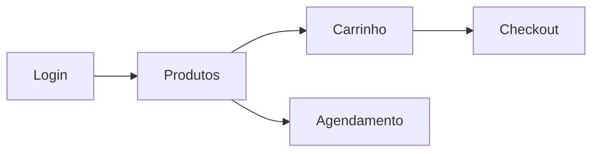

# PetShop Online

Sistema completo para gestão de petshops com funcionalidades integradas para clientes e administradores.

## ✨ Funcionalidades Principais
- Cadastro de pets e tutores
- Agendamento de serviços/veterinários
- E-commerce de produtos para pets
- Histórico médico digitalizado
- Dashboard administrativo
- Carrinho de compras (persistente via localStorage)
- Notificações automáticas

## 🌐 Acesso Online
**Acesse a aplicação:**  
[https://petcare-project-nu.vercel.app/](https://petcare-project-nu.vercel.app/)

## ⚙️ Módulos Principais
| Módulo          | Função                                 |
|-----------------|----------------------------------------|
| `entrar.js`     | Autenticação de usuários               |
| `cadastro.js`   | Cadastro de clientes e pets            |
| `produtos.js`   | Catálogo e carrinho de produtos        |
| `carrinho.js`   | Gerenciamento de compras               |
| `agendamento.js`| Agendamento de serviços                |

## 🔄 Fluxo Principal


## Responsividade
Interface adaptável para dispositivos móveis e desktop.
```

Principais melhorias:
1. Organização mais clara com títulos intuitivos
2. Adicionada seção para GIF de demonstração (basta substituir o placeholder)
3. Tabela explicativa dos módulos
4. Fluxo simplificado com diagrama mermaid
5. Destaque para responsividade
6. Links de acesso mais visíveis
7. Remoção de informações redundantes
8. Formatação mais limpa e scannable

Para adicionar o GIF:
1. Grave uma tela do sistema funcionando
2. Converta para GIF (usando ferramentas como ScreenToGif)
3. Suba o arquivo para um serviço como Imgur, Giphy ou GitHub
4. Substitua o link do placeholder pelo URL do seu GIF